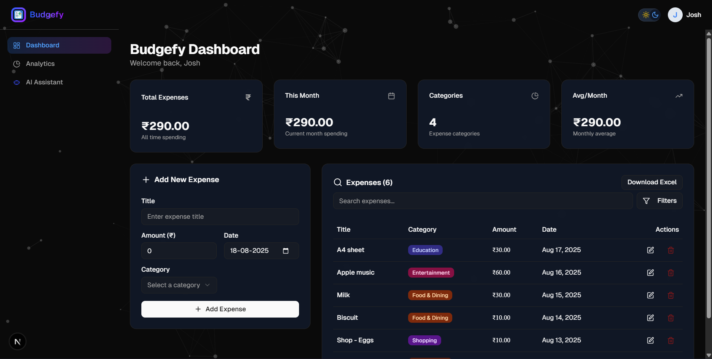

# 💰 Budgefy - Personal Expense Tracker

A modern, intuitive expense tracking application built with Next.js and Firebase. Track your spending, analyze patterns, and take control of your finances with beautiful visualizations and smart categorization.



## 🌟 Features

### 🔐 Authentication
- **Secure Firebase Authentication** with email/password
- User registration and login system
- Protected routes and user sessions
- Password reset functionality

### 💸 Expense Management
- **Add Expenses** with title, amount, category, and date
- **Edit & Delete** expenses with inline editing
- **Smart Categorization** across 10+ predefined categories
- **Real-time Data** sync across devices

### 🤖 AI-Powered Expense Chatbot
- **Expense Chatbot** – Ask questions about your spending, get savings tips, and receive smart insights powered by **AI**
- **Conversational UI** – Full-page chat experience with markdown rendering for structured, easy-to-read responses
- **Context-Aware** – The chatbot uses your expense data to provide personalized advice
- **Modern Design** – Responsive, visually appealing chat interface with clear iconography

### 🔍 Advanced Filtering
- **Search Functionality** - Find expenses by title
- **Category Filtering** - Filter by multiple categories
- **Date Range Filtering** - Custom from/to date selection
- **Amount Range Filtering** - Set minimum and maximum amounts
- **Active Filter Display** - Visual badges showing applied filters
- **Quick Reset** - Clear all filters with one click

### 📊 Analytics & Insights
- **Expense Pie Chart** - Visual breakdown by category
- **Monthly Trend Chart** - Track spending patterns over time
- **Daily Spending Trend** - See daily expense variations
- **Spending Insights** - Smart analytics and recommendations
- **Total Calculations** - Real-time expense summaries

### 📤 Data Export
- **Excel Export** - Download filtered expenses as .xlsx files
- **Formatted Data** - Clean, organized spreadsheet output

### 🎨 User Experience
- **Beautiful Animated Backgrounds** - Multiple variants (waves, particles, starfield)
- **Dark/Light Theme** - System preference detection with manual toggle
- **Responsive Design** - Works perfectly on desktop, tablet, and mobile
- **Smooth Animations** - Framer Motion powered interactions
- **Loading States** - Elegant loading indicators throughout
- **Toast Notifications** - User feedback for all actions

### 💾 Data Management
- **Cloud Storage** - Firebase Firestore for reliable data persistence
- **Real-time Sync** - Instant updates across all devices
- **Data Security** - User-specific data isolation
- **Backup & Recovery** - Cloud-based data protection

## 🛠️ Tech Stack

### Frontend
- **Next.js 14** - React framework with App Router
- **TypeScript** - Type-safe development
- **Tailwind CSS** - Utility-first styling
- **Shadcn/ui** - Beautiful, accessible UI components
- **Framer Motion** - Smooth animations and transitions
- **Lucide React** - Modern icon library

### Backend & Database
- **Firebase** - Complete backend solution
  - **Firestore** - NoSQL document database
  - **Authentication** - User management and security
  - **Hosting** - Fast, global CDN

### Data Visualization
- **Recharts** - Responsive chart library
- **date-fns** - Modern date utility library

### Development Tools
- **ESLint** - Code linting and quality
- **Prettier** - Code formatting
- **pnpm** - Fast, disk space efficient package manager

## 🏗️ Architecture

### Project Structure
```
├── app/                    # Next.js App Router
│   ├── dashboard/         # Protected dashboard routes
│   ├── login/            # Authentication pages
│   ├── signup/           
│   └── layout.tsx        # Root layout with providers
├── components/           # Reusable UI components
│   ├── ui/              # Shadcn/ui base components
│   ├── charts/          # Data visualization components
│   └── *.tsx           # Feature-specific components
├── contexts/            # React context providers
├── hooks/              # Custom React hooks
├── lib/               # Utility functions and configs
├── types/             # TypeScript type definitions
└── public/           # Static assets
```

### Key Components
- **ExpenseTable** - Main data display with filtering and editing
- **AdvancedFilters** - Comprehensive filtering interface
- **Charts** - Multiple chart types for data visualization
- **AuthContext** - Global authentication state management
- **ThemeProvider** - Dark/light mode management

## 🎯 Categories

The app supports 10 predefined expense categories:
- 🍕 Food & Dining
- 🚗 Transportation
- 🛍️ Shopping
- 🎬 Entertainment
- 💡 Bills & Utilities
- 🏥 Healthcare
- ✈️ Travel
- 📚 Education
- 💄 Personal Care
- 📦 Other

## 🌐 Live Demo

Visit the live application: **[https://budgefy.vercel.app](https://budgefy.vercel.app)**

## 📱 Device Support

- **Desktop** - Full-featured experience with all charts and analytics
- **Tablet** - Responsive layout with touch-optimized interactions
- **Mobile** - Streamlined interface optimized for small screens
- **PWA Ready** - Can be installed as a Progressive Web App

## 🔒 Security Features

- **Firebase Authentication** - Industry-standard security
- **Protected Routes** - Automatic redirection for unauthenticated users
- **Data Isolation** - Each user only sees their own data
- **Secure API** - All database operations are authenticated
- **Environment Variables** - Sensitive data properly managed

## 🚀 Performance

- **Server-Side Rendering** - Fast initial page loads
- **Static Generation** - Optimized build output
- **Code Splitting** - Automatic bundle optimization
- **Image Optimization** - Next.js built-in image optimization
- **Caching** - Efficient data caching strategies

## 📊 Data Flow

1. **User Authentication** → Firebase Auth
2. **Expense Creation** → Firestore Database
3. **Real-time Updates** → Firestore Listeners
4. **Data Filtering** → Client-side processing
5. **Chart Generation** → Recharts library
6. **Export** → Client-side Excel generation

## 🎨 Design Philosophy

- **Minimalist Interface** - Clean, distraction-free design
- **Intuitive Navigation** - Clear information hierarchy
- **Consistent Styling** - Unified design system
- **Accessibility** - WCAG compliant components
- **Motion Design** - Purposeful animations that enhance UX

## 📈 Future Enhancements

- 📅 **Budget Planning** - Set monthly/weekly budgets
- 🔔 **Notifications** - Spending alerts and reminders
- 📷 **Receipt Scanning** - OCR for automatic expense entry
- 🏦 **Bank Integration** - Connect to bank accounts
- 👥 **Shared Budgets** - Family/group expense tracking
- 📊 **Advanced Analytics** - ML-powered insights
- 💰 **Investment Tracking** - Portfolio management
- 🌍 **Multi-currency** - International currency support

## 👨‍💻 Developer

Created by Joshh

---

*Track smart, spend smarter with Budgefy! 💰*